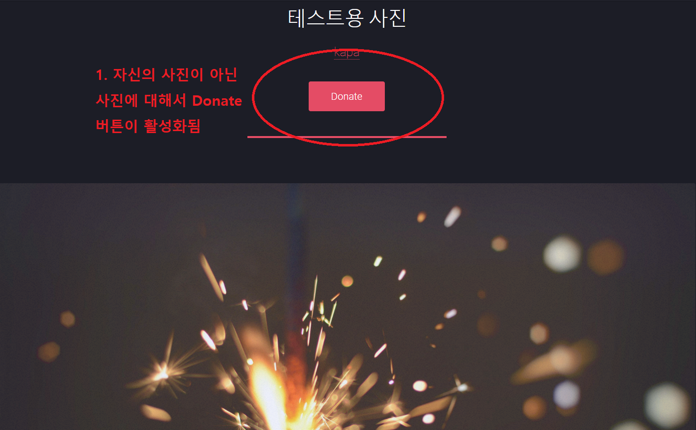
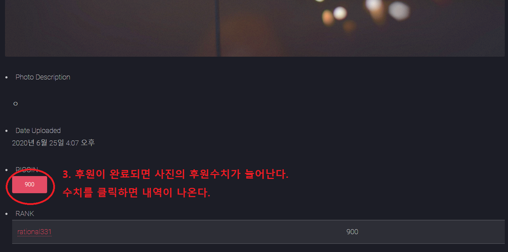

# PICO_3KIM
김령진, 김병찬, 김학규 졸업프로젝트
## 설치 방법
* git clone을 이용하여 프로젝트를 다운로드 받습니다.
* python -m venv [venv] 를 이용하여 가상환경을 설치합니다.
* pip install -r requirements.txt를 이용하여 종속성 파일들을 설치합니다.
* 관리자에게 secret파일을 받아와 지정된 위치에 저장합니다.
* 에러가 발생한다면 [venv]/Lib/site-packages/disqus/__init__.py파일에서 django.utils.six를 six로 고치시기 바랍니다.
## 개요
* 인터넷 방송과 같은 곳에서 후원할 수 있는 개념을 인스타그램에 끌고 오면 좋겠다는 생각으로 개발을 시작하였습니다. 
* 중심적으로 개발한 부분은 후원의 트랜잭션이며, 후원을 하면 개발을 한 사람의 wallet수치는 낮아지고, 사진의 주인의 wallet수치는 높아집니다. 또한, 이러한 수치의 이동을 기록으로 남겼으며, 사진에 대해서도 얼마나 증가하였는지에 대해서 기록을 남겼습니다. 위의 일련의 과정들을 atomic하게 이루어지게 개발을 하였습니다.

## 기본 모델
</img>

## 후원 예시
### 1. 후원하기 버튼은 자신의 사진이 아니면 후원버튼이 활성화된다.
</img>

### 2. 사진에 대해서 후원할 금액을 임의로 설정할 수 있다.
</img>

### 3. 후원을 마치면 사진에 대해서 총 후원된 금액이 변경되는 것을 알 수 있다.   버튼을 클릭하면 내역을 볼 수 있다.
</img>

### 4. 내역은 누가, 언제, 얼마나 후원했는지에 대한 정보를 볼 수 있다.
</img>

### 5. 후원한 사람의 wallet정보를 들어가게 되면 누구한테 언제 얼마나 어떤 사진에 대해서 후원했는지에 대한 내역을 볼 수 있다.
</img>

### 6. 후원 받은 사람도 누구한테 언제 얼마나 어떤 사진에 대해서 후원 받았는지에 대한 내역을 볼 수 있다.
</img>

### *참고로 위의 전 과정은 atomic하게 이루어진다.* 

